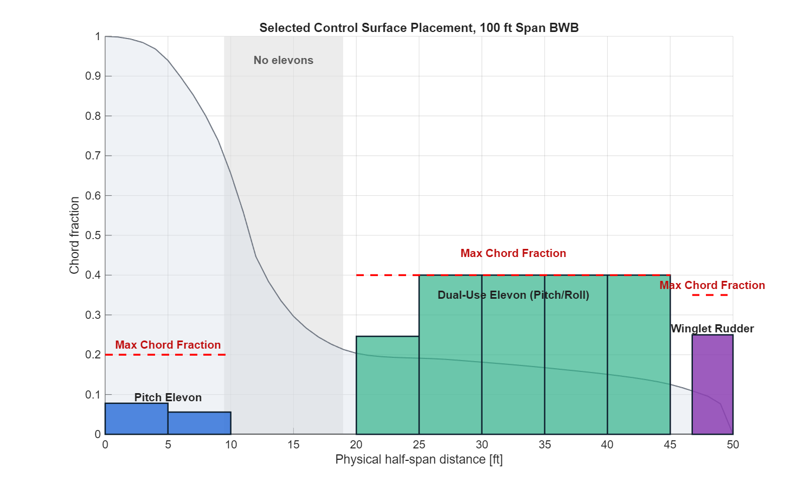
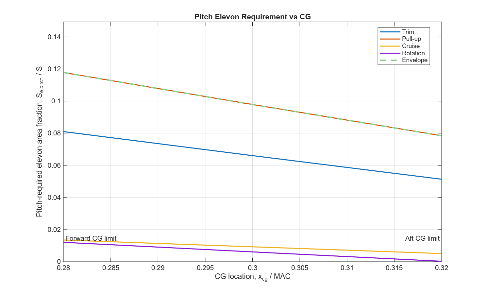

# BWB Control Surface Sizing

Conceptual MATLAB/CasADi demo for sizing pitch, roll, and rudder control surfaces on a 100 ft span blended-wing-body aircraft. The chord data are based on a NASA/Boeing X-48 outline scaled to the demo span.

## Results





## Run

Install CasADi for MATLAB, then make sure MATLAB can find it. This repo currently points to:

```matlab
C:\Program Files\MATLAB\casadi-3.7.2-windows64-matlab2018b
```

If your CasADi install is somewhere else, edit the path in:

```matlab
+DynamicsPkg/SetupCasadi.m
```

Then run from the repository root:

```matlab
DynamicsPkg.BWB_Dynamics_Demo(true, true)
```

The first argument generates the full report plots. The second argument re-optimizes pitch-required elevon area across the CG range.

## Notes

This is a conceptual sizing workflow, not a validated aircraft model. The demo aero/stability derivatives in `+DynamicsPkg/BWB_Dynamics_Demo.m` are placeholder values and should be replaced with project-specific data for design use.
